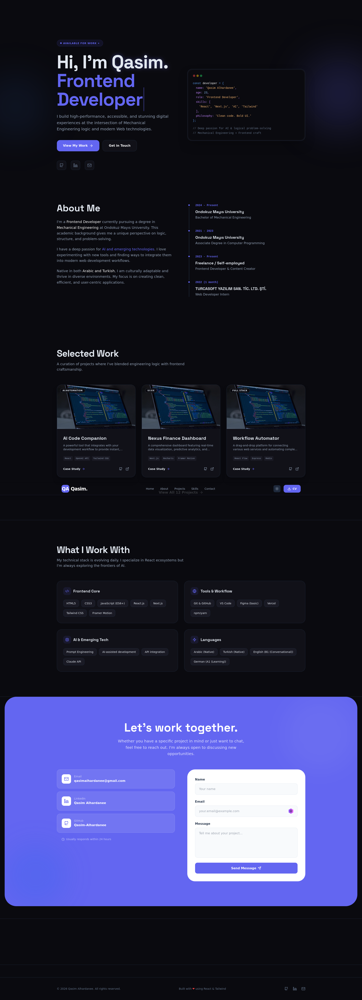
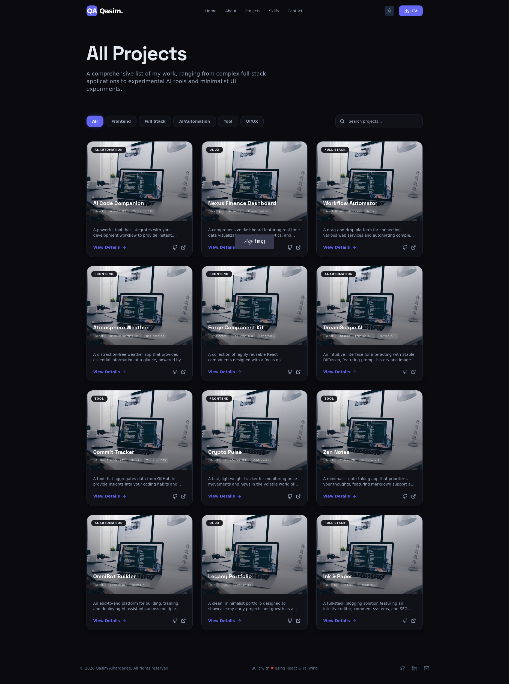

# Qasim Alhardanee — Personal Portfolio

[](https://qasim-alhardanee.created.app/)
[](https://github.com/Qasim-Alhardanee)

A modern, performant personal portfolio website built to showcase my projects, skills, and experience as a Frontend Developer. Designed with a dark-first aesthetic, smooth animations, and a focus on clean code.

---

## 🌐 Live Demo

**[qasim-alhardanee.created.app](https://qasim-alhardanee.created.app/)**

---

## 📸 Screenshots

<!-- Replace the paths below with your actual screenshot files -->
| Home | Projects | Project Detail |
|------|----------|----------------|
|  |  |  |

---

## ✨ Features

- **12 Project Cards** — each with category filters, live demo links, and dedicated detail pages
- **Project Detail Pages** — cover the idea, challenges faced, solutions found, screenshots, and key learnings
- **Downloadable CV** — available directly from the navigation
- **Skills Section** — grouped by category: Frontend, Frameworks, AI & Tools, Languages
- **Contact Form** — functional contact section with direct email and social links
- **Dark Mode First** — with light mode toggle
- **Fully Responsive** — optimized for mobile, tablet, and desktop
- **Smooth Animations** — scroll-reveal and micro-interactions throughout
- **SEO Optimized** — meta tags, Open Graph, JSON-LD structured data

---

## 🛠️ Tech Stack

| Layer | Technology |
|-------|-----------|
| Framework | Next.js 14 (App Router) |
| Styling | Tailwind CSS |
| Animations | Framer Motion |
| Icons | Lucide React |
| Fonts | Google Fonts |
| Deployment | Vercel |

---

## 🚀 Getting Started
```bash
# Clone the repository
git clone https://github.com/Qasim-Alhardanee/my-portfolio.git

# Navigate into the project
cd my-portfolio

# Install dependencies
npm install

# Start the development server
npm run dev
```

Open [http://localhost:3000](http://localhost:3000) in your browser.

---

## 📁 Project Structure
```
/app
  /page.tsx                  ← Home page
  /projects/page.tsx         ← All projects grid
  /projects/[slug]/page.tsx  ← Individual project detail
  /cv/page.tsx               ← Online CV
/components
  /ui/                       ← Reusable UI primitives
  /sections/                 ← Page sections
/data
  /projects.ts               ← All 12 project objects
  /resume.ts                 ← CV data
/public
  /screenshots/              ← Project screenshots
```

---

## 👤 About Me

I'm Qasim Alhardanee, a 23-year-old Frontend Developer based in Ankara, Turkey. I have a background in Computer Programming and am currently studying Mechanical Engineering — a combination that shapes how I approach problems: analytically and systematically.

I'm passionate about AI tools, modern web development, and building things that are both functional and visually sharp.

📧 [qasimalhardanee@gmail.com](mailto:qasimalhardanee@gmail.com)  
💼 [linkedin.com/in/qasim-alhardanee](https://linkedin.com/in/qasim-alhardanee)  
🐙 [github.com/Qasim-Alhardanee](https://github.com/Qasim-Alhardanee)

---

## 📄 License

This project is open source and available under the [MIT License](./LICENSE).

---

<p align="center">Built with Next.js & ❤ by Qasim Alhardanee</p>
